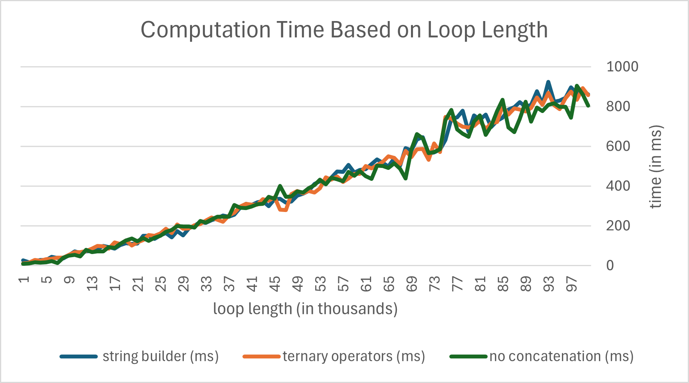

# Assignment
This is the implementation of the assignment for the Oracle NetSuite Summer Camp 2024.

## How To Run
The program can be run by the command:
```
java Assignment.java
```
or with compilation:
```
javac Assignment.java
java Assignment
```
provided the user is able to call the commands `javac` and `java`.

## Speed of Different Methods
This section is not a part of the assignment solution, it is purely a result of personal curiosity.

Given the static length of the loop, all methods take comparatively the same amount of time to run. Out of curiosity, I gathered computation times (in miliseconds) for each method (modified so that it included parameter `n`, with the loop running <1,n) times) for values `n` from 1,000 to 100,000.



As we can see, some discrepancy shows with growing `n`. The method that is not utilising any concatenations seems to be rather volatile in its computation time. Although with the higher values of `n`, it seems to outperform the two other methods more often than not. The other two methods seem more stable, with similar trends in their computation times.
